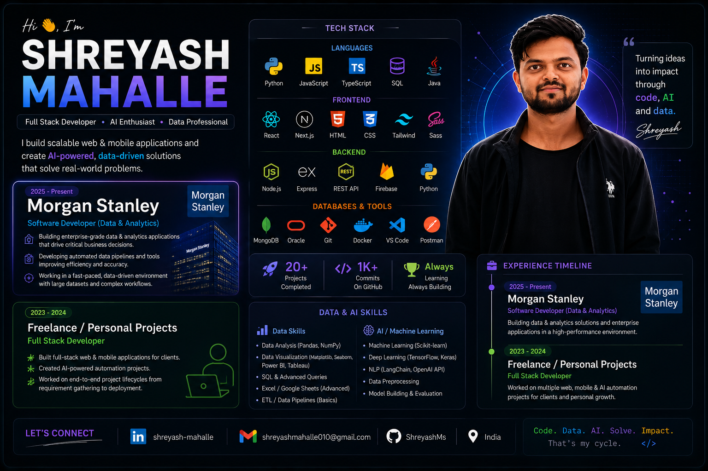

<h1 align="center">Hey 👋, I'm Shreyash Mahalle</h1>

<h3 align="center">
Software Developer • Full Stack Engineer • AI & Data Enthusiast
</h3>

<p align="center">
Building scalable software, AI-powered systems, and impactful digital products.
</p>

---

<p align="center">
  
</p>

---

<p align="center">
  <a href="https://github.com/ShreyashMs">
    
  </a>

  <a href="https://github.com/ShreyashMs">
    
  </a>

  
</p>

---

# 🚀 About Me

- 💻 Software Developer with strong Full Stack expertise
- 🏢 Software Developer @ **Morgan Stanley** (2025 – Present)
- 📊 Experience in Data Analytics & AI-powered systems
- 🤖 Building AI automation & scalable backend applications
- 📱 Passionate about Web & Mobile App Development
- 🌱 Currently exploring **Next.js**, AI workflows & system design
- ⚡ Night owl developer who loves building impactful products

---

# 💼 Experience

## 🏢 Morgan Stanley — Software Developer (Data & Analytics)

📍 2025 – Present

- Building enterprise-grade data & analytics applications
- Developing scalable internal tools & automation systems
- Working with large-scale datasets and business-critical workflows
- Creating AI/data-driven solutions for operational efficiency

---

## 🚀 Freelance & Personal Projects — Full Stack Developer

📍 2023 – 2024

- Built full-stack web & mobile applications
- Developed AI-powered automation systems
- Worked on end-to-end product development
- Delivered scalable frontend & backend solutions

---

# 🛠️ Tech Stack

## 👨‍💻 Languages

<p>
  
</p>

---

## 🎨 Frontend Development

<p>
  
</p>

---

## ⚙️ Backend Development

<p>
  
</p>

---

## 🗄️ Databases & Tools

<p>
  
</p>

---

# 📊 Data & AI Skills

<p align="left">

✔️ Python for Data Analysis  
✔️ Pandas & NumPy  
✔️ SQL & Database Querying  
✔️ Data Visualization  
✔️ Machine Learning Fundamentals  
✔️ AI Automation Systems  
✔️ API Integrations  
✔️ ETL & Data Processing  
✔️ OpenAI API Integration  
✔️ Scalable Backend Systems  

</p>

---

# 🔥 GitHub Streak

<p align="center">
  
</p>

---

# 🌐 Connect With Me

<p align="left">
  <a href="https://www.linkedin.com/in/shreyash-mahalle-794301220/" target="_blank">
    
  </a>

  <a href="mailto:shreyashmahalle010@gmail.com">
    
  </a>

  <a href="https://leetcode.com/u/shreyash_mahalle/" target="_blank">
    
  </a>

  <a href="https://www.instagram.com/shreyash.mahalle_ms/" target="_blank">
    
  </a>
</p>

---

# ⚡ Current Focus

```txt
Building AI-powered automation systems
Creating scalable full-stack applications
Learning advanced system design
Exploring AI + Data + Software Engineering
```

---

<h3 align="center">
Code. AI. Data. Products. 🚀
</h3>
